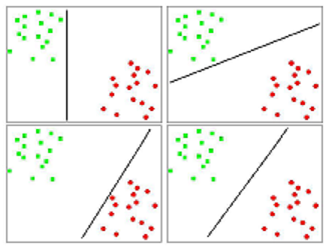

```{r, echo=FALSE, warning=FALSE, message=FALSE}
set.seed(4711)
library(tidyverse)
library(ggplot2)
library(e1071)
library(kernlab)
library(ISLR)
library(ggplot2)
library(dplyr)
```
\newpage
# Einleitung
Support Vector Machines (SVM) stellen Algorithmen des überwachten Lernens
(supervised learning) dar, mit denen es möglich ist sowohl Regressions- als auch
Klassifikationsprobleme zu behandeln.
Typischerweise werden allerdings Klassifikationsprobleme mittels SVM bearbeitet.[^1]

Im Falle einer Klassifikation kann jeder Datenpunkt im n-dimensionalen Raum durch
ein Tupel dargestellt werden. Somit ergeben sich sich N Tupel von Trainingsdaten zu:
$$(x_1,y_1),(x_2,y_2)\dots(x_N,y_N)\ mit\ x_i \in \mathbb{R}^n\ und\ y_i \in \{\pm 1\}$$
Hierbei stellt die erste Komponente,  $x_i$ die Eingangsdaten und die zweite
Komponente,  $y_i$, die Klassen, in die unterschieden werden sollen dar.

Die Trennung der Klassen erfolgt nun durch eine Hyperebene. Hierzu wird eine
Funktion gesucht, durch die die Trainingsmenge korrekt klassifiziert wird.

$$f: \mathbb{R}^n \to \{\pm1\}\ sodass\ f(x_i) = y_i$$

Neue Tupel werden somit durch folgende Funktion einer Klasse zugeordnet.

$$f(x_k)=y_k$$

## Lineare Trennung

Im simpelsten Anwendungsfall der SVM ist es möglich, die Daten linear zu seperieren.
Hierzu werden zwei beliebige Klassen von Daten betrachtet, die durch zwei
Einflussgrößen beschrieben sind.


In diesem einfachen Fall existieren bereits viele Möglichkeiten, die Klassen zu
trennen. Grafisch zeigt sich, dass neben einer horizontalen und vertikalen Trennung
diverse diagonale Trennungen erfolgen können. Einige vorstellbare Hyperebenen sind im
folgenden dargestellt.



Durch Abbildung 2 wird das Problem deutlich, welche lineare Trennung die optimale
ist. Deshalb gilt es nun aus diesen Möglichkeiten jene auszuwählen, welche den
breitesten Rand (margin) aufweist. Aus dieser Voraussetzung ergibt sich die
Bezeichnung der SVM als "large margin clssifier".
In diesem Fall wäre dies die Variante unten rechts in Abbildung 2. Neue Punkte
können somit mit einer maximalen Wahrscheinlichkeit der korrekten Klasse zugeordnet
werden.

Um den größten Abstand der Klassen zueinander zu ermitteln werden nur jene Vektoren
aus den Klassen betrachtet, die am nächsten zueinander liegen.
Die  Bezeichnung als Vektoren bezieht sich darauf, dass die Tupel in diesem
zwei-dimensionlen Beispiel zwar als Punkte dargestellt werden können, bei
mehr als drei Dimensionen sind diese allerdings mehrdimensionale Vektoren. 


```{r, out.width='70%'}
knitr::include_graphics('img/svm4.png')
```


Durch Abbildung 4 zeigt sich, dass zur Bestimmung der trennenden Hyperebene in
diesem Fall nur die Stützvektoren einen Einfluss nehmen. Die zentrale Gerade
zwischen den Stützvektoren wird als "seperating hyperplane" bezeichnet und stellt
die Hyperebene zur optimalen Trennung der Klassen dar.

# SVM Algorithmus

Zur Bestimmung der Hyperebene bzw. der Stützvektoren wird der im Folgenden
dargestellt Algorithmus verwendet.

1. Definition der trennenden Hyperebene:  $\mathcal{H}:=\{x\in\mathbb{R}^n\mid\langle w,x\rangle +b=0\}$
+ mit $w\in\mathbb{R}^n$ als zu $\mathcal{H}$ orthogonal Vektor
+ und $b\in\mathbb{R}$ als Verschiebung
2. Da dies noch keine eindeutige Definition der Hyperebene ist, denn $$\mathcal{H}=\{x\in\mathbb{R}^n\mid\langle aw,x\rangle +ab=0\}\ \forall a\in \mathbb{R}\backslash\{0\}$$, muss diese noch normiert werden.
+ Die Normierung erfolgt durch                                                       $\underset{i=1,\dots,N}{\min}\mid\langle aw,x\rangle +ab=1\mid$
3. Der Abstand eines Punktes $x_i$ zu einer Hyperebene lässt sich nun berechnen zu: $$y_i*(\langle \frac{w}{\|w\|},x_i\rangle+\frac{b}{\|w\|}$$
+ $\|w\|$ ist die Länge (Norm) des Vektors
5. Als Ergebnis ergibt sich durch Umformungen $$\langle \frac{w}{\||w\||},(x_1-x_2)\rangle=\frac{2}{\||w\||}$$
6. Um eine tatsächliche Trennung der Trainingsdaten durch die Hyperebene erreicht wird, wird die folgende Nebenbedingung eingeführt $$y_i*(\langle w,x_i\rangle+b\ge1$$


[^1]: https://blogs.sas.com/content/subconsciousmusings/files/2017/04/machine-learning-cheet-sheet.png

## Besonderheiten der SVM

Im Gegensatz zu anderen Klassifikationalgorithmen betrachtet eine SVM als Grundlage
zur Einteilung in eine Klasse nicht die "typischen" Eigenschaften dieser Klassen.
Stattdessen werden die am weitesten von Zentrum einer Klasse entfernten Vektoren
miteinander verglichen. Aus dem Vergleich dieser kann die "seperating hyperplane"
ermittelt werden. Somit zeigt sich, dass die Anzahl an Werten irrelevant ist. Diese
Eigenschaft unterscheidet eine SVM von vielen anderen Klassifikationsalgorithmen.

# Nichtlineare Klassifikation

Da in der Realität nicht alle Klassifikationsprobleme von Grund auf linear
seperierbar sind, können diese Fälle durch die Verwendung des Kern-Tricks dennoch
linear seperierbar gemacht werden.

## Grundlagen
 
image: 
```{r}
#TODO Abbildung NR.
```

Betrachtet wird in Abbildung XX der Fall, dass die vorliegenden Daten im Ursprungssraum nicht linear seperierbar sind 

# Anwendungsbeispiele


# Literatur