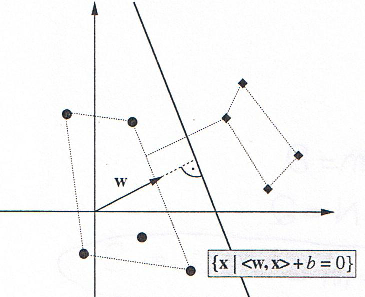
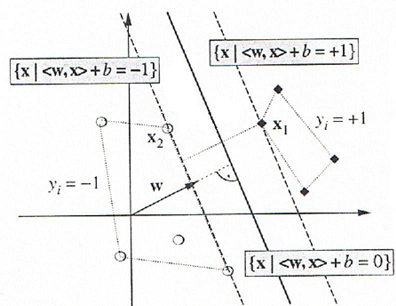

```{r, echo=FALSE, warning=FALSE, message=FALSE}
options(tinytex.verbose = TRUE)
set.seed(4711)
library(tidyverse)
library(ggplot2)
library(e1071)
library(kernlab)
library(ISLR)
library(dplyr)
library(knitr)
library(png)
```
\newpage
# Einleitung
Support Vector Machines (SVM) stellen
Algorithmen des überwachten Lernens
(supervised learning) dar, mit denen es
möglich ist sowohl Regressions- als auch
Klassifikationsprobleme zu behandeln.
Typischerweise werden allerdings
Klassifikationsprobleme mittels SVM
bearbeitet.[^1]

Im Falle einer Klassifikation kann jeder Datenpunkt im n-dimensionalen
Raum durch
ein Tupel dargestellt werden. Somit ergeben sich sich N Tupel von
Trainingsdaten zu:
$$T=(x_1,y_1),(x_2,y_2)\dots(x_N,y_N)\ mit\ x_i \in \mathbb{R}^n\ und\ y_i \in \{\pm 1\}$$
Hierbei stellt die erste Komponente,  $x_i$ die Eingangsdaten und die
zweite Komponente,  $y_i$, die Klassen, in die unterschieden werden sollen
dar.

Die Trennung der Klassen erfolgt nun durch eine Hyperebene. Hierzu wird
eine Funktion gesucht, durch die möglichst viele Elemente der Trainingsmenge korrekt klassifiziert werden.

$$f: \mathbb{R}^n \to \{\pm1\}\ $$
$$\ f(x_i) = y_i$$

Neue Tupel werden somit durch folgende Funktion einer Klasse
zugeordnet.

$$f(x_k)=y_k$$

# Lineare Trennung

Im simpelsten Anwendungsfall der SVM ist es möglich, die Daten linear
zu seperieren. Hierzu werden zwei beliebige Klassen von Daten betrachtet, die durch
zwei Einflussgrößen beschrieben sind betrachtet. Durch die alleinige Betrachtung der grafischen Darstellung wird bereits deutlich, dass keine eindeutige Möglichkeit der trennung existiert.

```{r, echo=FALSE, fig.cap="zwei Klassen von Daten"}

```

\newpage
## Hyperebenen
In diesem einfachen Fall existieren bereits viele Möglichkeiten, die Klassen zu trennen.
Es zeigt sich, dass neben einer vertikalen Trennung diverse
diagonale Trennungen erfolgen können.
Einige mögliche Hyperebenen sind im folgenden dargestellt.

```{r, echo=FALSE, fig.cap="potentielle Hyperebenen"}
knitr::include_graphics("img/svm2.png")
```


Durch Abbildung 2 wird das Problem deutlich, welche lineare Trennung
die optimale ist. Deshalb gilt es nun aus diesen Möglichkeiten jene auszuwählen,
welche den breitesten Rand (margin) aufweist. Aus dieser Voraussetzung
ergibt sich die Bezeichnung der SVM als "large margin clssifier".
In diesem Fall wäre dies die Variante unten rechts in Abbildung 2. Neue
Punkte können somit mit einer maximalen Wahrscheinlichkeit der korrekten Klasse zugeordnet
werden.

Um den größten Abstand der Klassen zueinander zu ermitteln werden nur
jene Vektoren aus den Klassen betrachtet, die am nächsten zueinander
liegen. Die  Bezeichnung "Vektoren"" bezieht sich darauf, dass die
Tupel in diesem zwei-dimensionlen Beispiel zwar als Punkte dargestellt
werden können, bei mehr als drei Dimensionen allerdings mehrdimensionale Vektoren sind.

```{r, echo=FALSE, fig.cap="Margin der Hyperebene"}

```


Durch die Abbildung zeigt sich, dass zur Bestimmung der
trennenden Hyperebene in diesem Fall nur die Stützvektoren
einen Einfluss nehmen. Die Gerade zwischen den Stützvektoren
wird als "seperating hyperplane" bezeichnet und stellt die
Hyperebene zur optimalen Trennung der Klassen dar.


## Algorithmus

Zur Bestimmung der Hyperebene bzw. der Stützvektoren wird der im
Folgenden skizzierte Algorithmus verwendet.

Definition der trennenden Hyperebene:  
$$\mathcal{H}:=\{x\in\mathbb{R}^n\mid\langle w,x\rangle +b=0\}$$
mit $w\in\mathbb{R}^n$ als zu $\mathcal{H}$ orthogonaler
Vektor und $b\in\mathbb{R}$ als Verschiebung.

```{r, echo=FALSE, fig.cap="Trennung zweier Klassen durch eine Hyperebene"}

```


Dies ist allerdings noch keine eindeutige Definition der
Hyperebene, denn
$$\mathcal{H}=\{x\in\mathbb{R}^n\mid\langle aw,x\rangle +ab=0\}\ \forall a\in \mathbb{R}\backslash\{0\}$$

Zur Behebung dieses Problems muss noch relativ zu den
Trainingsdaten normiert werden, durch:
$$\underset{i=1,\dots,N}{\min}\mid\langle w,x\rangle +ab\mid=1$$

Wird diese Bedingung erfüllt, ergibt sich die kanonische
Form der Hyperebene.

Der Abstand eines Punktes $x_i$ zur
Hyperebene lässt sich nun berechnen zu:
$$y_i(\langle \frac{w}{\|w\|},x_i\rangle+\frac{b}{\|w\|})$$
mit $\|w\|$ als Länge (Norm) des Vektors.

Durch die Skalierung gilt für $x_1$ und $x_2$:
$$\langle w,x_1\rangle+b=+1\ und\ \langle w,x_2\rangle+b=-1$$

Im nächsten Schritt kann nun der Rand (margin) bestimmt werden. Dieser beschreibt den Abstand der Hyperebene zu dem Punkt, der ihr am nächsten liegt. 
```{r, echo= FALSE, fig.cap="Punkte $x_1$ und $x_2$"}

```

Als Ergebnis ergibt sich durch Umformungen:
$$\langle w,x_1\rangle+b=+1\\\langle w,x_2\rangle+b=-1\\\Rightarrow\langle w,(x_1-x_2)\rangle=2\\\Rightarrow\langle \frac{w}{\|w\|},(x_1-x_2)\rangle=\frac{2}{\|w\|}$$

Um den Rand nun zu maximieren, muss die Länge des Vektors $w$ minimiert werden.

Um eine tatsächliche Trennung der Trainingsdaten durch die
Hyperebene zu erreichen, wird der Term $\langle w,x\rangle+b$ mit der Klasse $y_i$ multipliziert, sodass das Ergebnis für richtig Klassifizierungen immer positiv ist. Hierdurch ergibt sich die folgende Nebenbedingung.
$$y_i(\langle w,x_i\rangle+b)\ge1\ \forall i=1,\dots,N$$

Somit entsteht ein Problem der quadratischen Programmierung, bei dem
Lagrange-Multiplikatoren $\alpha_i\ge0$ eingeführt.
Die Lagrange-Funktion wird für $w\ und\ b$ minimiert und für $\alpha_i$ maximiert.
$$L(w,b,\alpha)=\frac{1}{2}\|w\|^2-\sum_{i=1}^N\alpha_i(y_i(\langle w,x_i\rangle+b)-1)$$

Werden die partiellen Ableitungen von $L$ nach $w$ und $b$ gleich $0$
gesetzt erhält man:
$$\sum_{i=1}^N\alpha_iy_i=0\ und\ w=\sum_{i=1}^N\alpha_iy_ix_i$$

Für das Optimum gilt nun: $$\alpha_i=0\ oder\ y_i(\langle x_i,w\rangle)+b=1$$

Somit haben nur die Punkte mit $\alpha_i \geq0$ einen Einfluss auf die optimale Lösung. Diese Punkte werden als "support vectors" bzw. "Stützvektoren" bezeichnet.

Durch das Vorzeichen der Funktion kann nun über die Zuordnung zu einer Klasse entschieden werden. $$f(x_{neu})=sign(\sum_{i=1}^N\alpha_iy_i\langle x,x_i\rangle+b)$$


## Besonderheiten der SVM

Im Gegensatz zu anderen Klassifikationalgorithmen betrachtet eine SVM als Grundlage
zur Einteilung in eine Klasse nicht die "typischen" Eigenschaften dieser Klassen.
Stattdessen werden die am weitesten von Zentrum einer Klasse entfernten Vektoren
miteinander verglichen. Aus dem Vergleich dieser kann die "seperating hyperplane"
ermittelt werden. Somit zeigt sich, dass die Anzahl an Werten irrelevant ist. Diese
Eigenschaft unterscheidet eine SVM von vielen anderen Klassifikationsalgorithmen.

# Nichtlineare Klassifikation

Da in der Realität nicht alle Klassifikationsprobleme von Grund auf linear
seperierbar sind, können diese Fälle durch die Verwendung des Kern-Tricks dennoch
linear seperierbar gemacht werden.
Betrachtet wird in Abbildung 3 der Fall, dass die vorliegenden Daten im
Ursprungssraum nicht linear seperierbar sind. Um diesen Fall nun dennoch durch eine
Hyperebene linear seperieren zu können werden der Vektorraum und die Trainingsdaten durch eine Funktion $\Phi$ in einen höherdimensionalen Raum überführt, in dem sie linear seperierbar sind. Bei der Rücktransformation in den Ursprungsraum entsteht eine nicht-lineare Trennung der Klassen.


Das dargestellte Problem ist im Ursprungsraum nicht linear seperierbar, allerdings ist dies im Featureraum $H$ möglich. Die Transformation der Abbildung vom zwei- in den dreidimensionalen Raum kann folgendermaßen vorgenommen werden:
$$\Phi(g_1,g_2)=(g_1^2,\sqrt{2}*g_1*g_2,g_2^2)$$

Durch eine Kernel-Funktion, die im Ursprungsraum definiert ist, ist es möglich, diese im feature space wie ein Skalarprodukt zu behandeln.
$$K(p,q)=\langle\Phi(p),\Phi(q)\rangle$$

Das Skalarprodukt kann hierbei berechnet werden ohne die Funktion $\Phi$ zu berechnen. Das Vorgehen des Kernel-Tricks könnte als Blackbox angesehen werden, da der feature space und die Abbildung in diesen nicht bekannt sein muss.
Übliche Kernel sind z.B.:

Linearer Kernel
$$K(p,q)=\langle p,q\rangle$$

Polynomialer Kernel
$$K(p,q)=(\gamma\langle p,q\rangle+c_0)^d$$

Radiale Basisfunktion (Gauss Kernel)
$$K(p,q)=exp(-\gamma\|p-q\|)^2$$

# Vor- und Nachteile

Abschließend werden Vor- und Nachteile der Klassifikation mittels SVM dargestellt.

## Vorteile
* Da die benötigten Parameter auf wenigen Support Vektoren basieren, ist eine Klassifikation durch eine SVM  sehr schnell möglich.
* SVM bieten eine hohe Generalisierungsfähigkeit für z.B. nicht linear seperierbare Probleme.
* Die Arbeit in hohen Dimensionen wird ermöglicht.

## Nachteile
* Für neue Daten muss jedes mal ein neues Training durchgeführt werden.
* Die Wahl eines geeigneten Kernels gestaltet sich schwierig. Dieser muss empirisch gesucht werden.

# Anwendungsbeispiele

Der SVM Algorithmus findet in diversen Bereichen Anwendung, z.B. in bei
der Erkennung von Fingerabdrücken[^2] oder der Klassifikation von Emotionen
einer Testperson anhand des Pulses und des Alters.[^3] Außerdem werden
SVM häufig für die Klassifikation von Handschrift verwendet.[^4][^5]
Neben diesen Beispielen findet sich in der Praxis auch der
Anwendungsfall, Schäden an Rotorblättern von Windkraftanlagen zu
klassifizieren.[^6]


\newpage

# Quellen

* Z. Chunhua, D. Naiyang, T. Yingjie - Support vector machines : optimization based theory, algorithms, and extensions
* J. Fischer - Support Vector Machines (SVM)
* T. Hastie, R. Tibshirani, J. Friedman. The elements of statistical learning
* F. Markowetz - Classification by SVM
* Schölkopf - Statistical Learning an Kernel Methods
* S. Raval - Support Vector Machines
* W. Steinbuß - Skript Ueberleitung_NN_SVM

[^1]: https://blogs.sas.com/content/subconsciousmusings/files/2017/04/machine-learning-cheet-sheet.png
[^2]: http://www.iaescore.com/journals/index.php/IJEECS/article/view/10018
[^3]: https://github.com/akasantony/pulse-classification-svm
[^4]: https://github.com/ksopyla/svm_mnist_digit_classification
[^5]: https://ieeexplore.ieee.org/abstract/document/1030883/
[^6]: http://www.futureblades.com/
