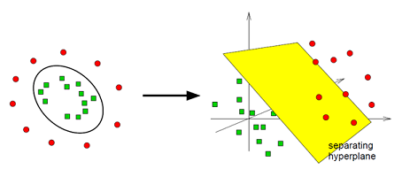

```{r, echo=FALSE, warning=FALSE, message=FALSE}
set.seed(4711)
library(tidyverse)
library(ggplot2)
library(e1071)
library(kernlab)
library(ISLR)
library(ggplot2)
library(dplyr)
```
\newpage
#Grundlagen

Support Vector Machines (SVM) stellen Algorithmen des überwachten Lernens
(supervised learning) dar, mit denen es möglich ist sowohl Regressions- als auch
Klassifikationsprobleme zu behandeln.
Typischerweise werden allerdings Klassifikationsprobleme mittels SVM bearbeitet.[^1]

Im Falle einer Klassifikation kann jeder Datenpunkt im n-dimensionalen Raum durch
ein Tupel dargestellt werden. Somit ergeben sich sich N Tupel von Trainingsdaten zu:
$$(x_1,y_1),(x_2,y_2)\dots(x_N,y_N)\ mit\ x_i \in \mathbb{R}^n\ und\ y_i \in \{\pm 1\}$$
Hierbei stellt die erste Komponente,  $x_i$ die Eingangsdaten und die zweite
Komponente,  $y_i$, die Klassen, in die unterschieden werden sollen dar.

Die Trennung der Klassen erfolgt nun durch eine Hyperebene. Hierzu wird eine
Funktion gesucht, durch die die Trainingsmenge korrekt klassifiziert wird.

$$f: \mathbb{R}^n \to \{\pm1\}\ sodass\ f(x_i) = y_i$$

## Lineare Separierbarkeit

Im simpelsten Anwendungsfall der SVM ist es möglich, die Daten linear zu seperieren.
Hierzu werden zwei beliebige Klassen von Daten betrachtet, die durch zwei
Einflussgrößen beschrieben sind.


In diesem einfachen Fall existieren bereits viele Möglichkeiten, die Klassen zu
trennen. Grafisch zeigt sich, dass neben einer horizontalen und vertikalen Trennung
diverse diagonale Trennungen erfolgen können. Einige vorstellbare Hyperebenen sind im
folgenden dargestellt.


Durch Abbildung 2 wird das Problem deutlich, welche lineare Trennung die optimale
ist. Deshalb gilt es nun aus diesen Möglichkeiten jene auszuwählen, welche den
größten Abstand zu der Klassen aufweist. In diesem Fall wäre dies die Variante
unten rechts in Abbildung 2. Neue Punkte können somit mit einer maximalen
Wahrscheinlichkeit der korrekten Klasse zugeordnet werden.

Um den größten Abstand der Klassen zueinander zu ermitteln werden nur jene Vektoren
betrachtet, die dem Rand am nächsten liegen. 

<!--  -->
```{r, out.width='70%'}

```


Durch Abbildung 4 zeigt sich, dass zur Bestimmung der trennenden Hyperebene in
diesem Fall nur die Stützvektoren einen Einfluss nehmen. Die zentrale Gerade zwischen
den Stützvektoren wird als "seperating hyperplane" bezeichnet und stellt die
Hyperebene zur optimalen Trennung der Klassen dar.

[^1]: https://blogs.sas.com/content/subconsciousmusings/files/2017/04/machine-learning-cheet-sheet.png

## Besonderheiten der SVM

Im Gegensatz zu anderen Klassifikationalgorithmen betrachtet eine SVM als Grundlage
zur Einteilung in eine Klasse nicht die "typischen" Eigenschaften dieser Klassen.
Stattdessen werden die am weitesten von Zentrum einer Klasse entfernten Vektoren
miteinander verglichen. Aus dem Vergleich dieser kann die "seperating hyperplane"
ermittelt werden. Somit zeigt sich, dass die Anzahl an Werten irrelevant ist. Diese
Eigenschaft unterscheidet eine SVM von vielen anderen Klassifikationsalgorithmen.

# Nichtlineare Klassifikation

Da in der Realität nicht alle Klassifikationsprobleme von Grund auf linear
seperierbar sind, können diese Fälle durch die Verwendung des Kern-Tricks dennoch
linear seperierbar gemacht werden.

## Grundlagen

Ziel ist es, weiterhin eine 


# Literatur

#Implementierung

```{r}
#read previously inputed data
train <- read.csv("data/train_imputed.csv")
test <- read.csv("data/test_imputed.csv")

#view imputed data
summary(train)
summary(test)

#Preprocessing

#-RevolvingUtilizationOfUnsecuredLines
#-- (total balance) / (total credit limit)

# the closer this value is to 100% the more the consumer is using the credit limit 
summary(train$RevolvingUtilizationOfUnsecuredLines)
mis <-train %>%
  filter(train$RevolvingUtilizationOfUnsecuredLines > 1)
summary(mis)

#percentage of regressor > 1 in train data
nrow(mis)/nrow(train)*100

#apply coded value -1 to outliers
train$RevolvingUtilizationOfUnsecuredLines[train$RevolvingUtilizationOfUnsecuredLines > 1] <- -1

summary(train$RevolvingUtilizationOfUnsecuredLines)

#-age

summary(train$age)
mis <- train %>%
  filter(train$age == 0)
nrow(mis)

#omit line with age = 0
train <- subset(train, age > 0)

#-NumberOfTimeXX_XXDaysPastDueNotWorse

summary(train$NumberOfTime30_59DaysPastDueNotWorse)
summary(train$NumberOfTime60_89DaysPastDueNotWorse)
summary(train$NumberOfTimes90DaysLate)

#it can be assumed that 96 and 98 are coded values of some kind, 
#because both values have their own meaning they cant be ommited
# and have to be encoded
nrow(subset(train, train$NumberOfTime30_59DaysPastDueNotWorse >=15))
n_96 <- nrow(subset(train, train$NumberOfTime30_59DaysPastDueNotWorse ==96))
n_98 <- nrow(subset(train, train$NumberOfTime30_59DaysPastDueNotWorse ==98))

(n_96+n_98)/nrow(train)*100

train$NumberOfTime30_59DaysPastDueNotWorse[
  train$NumberOfTime30_59DaysPastDueNotWorse >= 15]<- -1

summary(train$NumberOfTime30_59DaysPastDueNotWorse)

#the same approach applies to NumberOfTime60_89DaysPastDueNotWorse and
#NumberOfTimes90DaysLate
nrow(subset(train, train$NumberOfTime60_89DaysPastDueNotWorse >=15))
n_96 <- nrow(subset(train, train$NumberOfTime60_89DaysPastDueNotWorse ==96))
n_98 <- nrow(subset(train, train$NumberOfTime60_89DaysPastDueNotWorse ==98))

(n_96+n_98)/nrow(train)*100

train$NumberOfTime60_89DaysPastDueNotWorse[
  train$NumberOfTime60_89DaysPastDueNotWorse >= 15] <- -1

summary(train$NumberOfTime60_89DaysPastDueNotWorse)

summary(train$NumberOfTimes90DaysLate)
nrow(subset(train, train$NumberOfTimes90DaysLate >=19))
n_96 <- nrow(subset(train, train$NumberOfTimes90DaysLate ==96))
n_98 <- nrow(subset(train, train$NumberOfTimes90DaysLate ==98))

(n_96+n_98)/nrow(train)*100

train$NumberOfTimes90DaysLate[train$NumberOfTimes90DaysLate >= 19] <- -1

summary(train$NumberOfTime60_89DaysPastDueNotWorse)

#- DebtRatio
#-- (total debts) / (monthly income)
#-- thus, values > 1 indicate more debts than income

summary(train$DebtRatio)
summary(train$MonthlyIncome)

#monthly income is the denominator of debt ratio thus it cannot be 0
#percentage of regressor > 1 in train data
n_inc0 <- nrow(subset(train, train$MonthlyIncome ==0))
n_inc0/nrow(train)*100

#if the monthly salary is equal to zero it is replaced by -1 

index <- train$MonthlyIncome == 0
train$DebtRatio[index] <- -1
summary(train$MonthlyIncome)

#if the monthly income is missing, it is replaced by 1

train$MonthlyIncome[is.na(train$MonthlyIncome)] <- 1

summary(train$DebtRatio)

#-Monthly income

summary(train$MonthlyIncome)

n_inc50k <- nrow(subset(train, train$MonthlyIncome >50000))
n_inc50k/nrow(train)*100

#omit outliers
train <- subset(train, MonthlyIncome < 50000)

#-NumberOfOpenCreditLinesAndLoans

summary(train$NumberOfOpenCreditLinesAndLoans)

#omit outliers in the 99th percentile

nrow(train[train$NumberOfOpenCreditLinesAndLoans < quantile(train$NumberOfOpenCreditLinesAndLoans, 0.99),])
train <- train[train$NumberOfOpenCreditLinesAndLoans < quantile(train$NumberOfOpenCreditLinesAndLoans, 0.99),]
summary(train$NumberOfOpenCreditLinesAndLoans)

#-NumberOfDependents

summary(train$NumberOfDependents)

#omit outliers in the 99th percentile

nrow(train[train$NumberOfDependents < quantile(train$NumberOfDependents, 0.99),])
train <- train[train$NumberOfDependents < quantile(train$NumberOfDependents, 0.99),]
summary(train$NumberOfDependents)

summary(train)


#remove ids
train <- train[-1]
test <- test[-1]


#Modelling
#seed for reproducibility
set.seed(123)

#svm classifier using e1071
library(e1071)
# classifier <- svm(formula = SeriousDlqin2yrs ~ ., 
#                   data = train, 
#                   type = "C-classification", 
#                   kernel = "linear")

# classifier_rbf <- svm(formula = SeriousDlqin2yrs ~ ., 
                  # data = train, 
                  # type = "C-classification", 
                  # kernel = "radial")

# pred_lin <- predict(classifier, newdata = test[-1])
# pred_rbf <- predict(classifier_rbf, newdata = train[-1])
```

